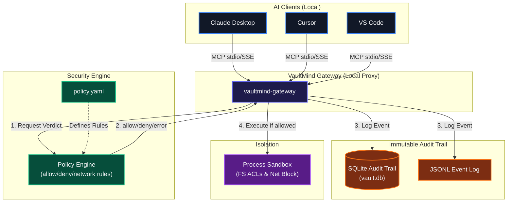

# 🔐 VaultMind

**Offline-First AI Environment for Sensitive Code**

VaultMind is the first open-source **policy decision point** for AI coding agents that runs completely offline. It combines a lightweight secure MCP gateway, an immutable audit trail, and a software supply chain explorer — so finance, defense, and regulated-industry teams can finally use AI coding tools without sending secrets to the cloud.

[](LICENSE)
[](tests/)


---

## ❓ Why VaultMind?

Every major AI coding client — Claude Desktop, Cursor, VS Code with Copilot — streams every interaction to external cloud services. Teams working in finance, defense, and regulated industries are **blocked** from these tools entirely because their secrets cannot leave their security perimeter.

**No existing solution bridges the gap between AI productivity and enterprise security.** VaultMind does.



---

## 🚀 Quick Start (3 minutes)

```bash
# Install from source
git clone https://github.com/your-org/vaultmind.git
cd vaultmind
npm install

# Create a policy file
npx tsx packages/cli/src/index.ts init

# Start recording a session
npx tsx packages/cli/src/index.ts record -- echo "hello, air-gapped world"

# Analyze audit logs
npx tsx packages/cli/src/index.ts analyze

# Generate policy from audit log
npx tsx packages/cli/src/index.ts policy generate

# Start the gateway server
npx tsx packages/cli/src/index.ts gateway start --port 3080
```

Then open `http://127.0.0.1:3080` for the live dashboard.

---

## ✨ Key Features

### 1. Offline-First MCP Proxy
Works without internet. Intercepts every tool call from AI agents (read, write, exec, network) and evaluates them against a local `policy.yaml`.

```yaml
# policy.yaml
version: "1.0"
rules:
  - id: "allow-docs"
    allow:
      - "read(docs/*)"
      - "read(*.md)"
  - id: "block-src-writes"
    deny:
      - "write(src/*)"
      - "write(lib/*)"
  - id: "network-off"
    network: "off"
default_action: "deny"
```

### 2. Immutable Audit Trail
Every tool call is logged — JSONL for fast streaming, SQLite for structured queries. Each event carries:
- **Agent** (claude, cursor, vscode)
- **Tool** called
- **Parameters** passed
- **Verdict** — allow / deny / error
- **Reason** — which policy rule applied

### 3. Policy-as-Code
Your security policy lives in `policy.yaml`. Store it in Git, review it in PR, and never guess what an AI agent can access.

### 4. Auto Policy Generation
Run `vaultmind policy generate` — VaultMind analyzes all past audit logs and produces a `policy.yaml` skeleton that captures observed safe patterns. Only requires final human approval.

### 5. Sandbox Execution
Commands run through a sandbox that restricts filesystem access and blocks network calls. Resource limits (timeout, allowed paths) are configurable.

### 6. Dependency Memoization
`vaultmind deps memo` scans your `package-lock.json`, `go.sum`, or `Cargo.lock` and builds a dependency DAG. `vaultmind deps verify` checks it against local vulnerability data.

---

## 📦 Packages

| Package | Description |
|---------|------------|
| `@vaultmind/vm-core` | Shared types, policy engine, audit logger, SQLite DB |
| `@vaultmind/vm-sandbox` | Process sandbox with path ACLs and network blocking |
| `@vaultmind/mcp-gateway` | MCP proxy + HTTP/WebSocket API server |
| `@vaultmind/cli` | CLI entrypoint (`vaultmind init|record|analyze|gateway`) |
| `@vaultmind/sdk` | Programmatic SDK + fluent `createPolicyHelper()` |

---

## 🗄️ Database Schema

State is stored in a lightweight SQLite file (`.vaultmind/vault.db`):

```sql
CREATE TABLE sessions (
    id TEXT PRIMARY KEY,
    start_time INTEGER NOT NULL,
    policy_hash TEXT,
    status TEXT CHECK(status IN ('recording','analyzing','done'))
);

CREATE TABLE events (
    id INTEGER PRIMARY KEY AUTOINCREMENT,
    session_id TEXT NOT NULL,
    ts INTEGER NOT NULL,
    agent TEXT NOT NULL,
    tool TEXT NOT NULL,
    params TEXT NOT NULL,       -- JSON
    verdict TEXT CHECK(verdict IN ('allow','deny','error')),
    reason TEXT
);
```

---

## 🔌 API

| Method | Path | Description |
|--------|------|------------|
| `POST` | `/v1/sessions` | Create new audit session → `{ sessionId, wsUrl }` |
| `GET` | `/v1/sessions/:id/events` | Paginated event history |
| `POST` | `/v1/sessions/:id/stop` | End session + final report |
| `POST` | `/v1/policies/validate` | Validate a `policy.yaml` |
| `GET` | `/v1/stats` | Server status + connection counts |
| `WS` | `/v1/stream` | Real-time event stream |

---

## 💻 SDK Usage

```typescript
import { createPolicyHelper } from '@vaultmind/sdk';
import { VaultMindClient } from '@vaultmind/sdk';

// Fluent policy builder
const policy = createPolicyHelper()
  .allow('read(docs/*)')
  .deny('write(src/*)')
  .network('off')
  .build();

// Programmatic client
const client = new VaultMindClient();
await client.startSession();
const result = await client.evaluateCall({
  tool: 'read_file',
  args: {},
  action: 'read',
  path: 'docs/guide.md',
});
console.log(result.verdict); // 'allow' | 'deny'
console.log(client.getStats()); // { total, allowed, denied, errors }
await client.endSession();
```

---

## 📁 Project Structure

```
vaultmind/
├── packages/
│   ├── vm-core/           # Shared types, policy engine, DB, logger
│   ├── vm-sandbox/        # Execution sandbox
│   ├── mcp-gateway/       # MCP proxy + REST/WS server
│   ├── cli/               # CLI entrypoint
│   └── sdk/               # TypeScript SDK
├── dashboard/
│   └── src/index.html     # Real-time monitoring dashboard
├── tests/                 # Integration & policy tests
├── docs/                  # MkDocs material
├── examples/              # Docker, Nix, systemd units
└── policy.yaml            # Default security policy
```

---

## ⚠️ Known Limitations

- **No kernel sandbox on Windows**: True seccomp/Landlock requires Linux + Rust. The current MVP provides policy-level process isolation. Linux sandbox is planned for Month 2.
- **Network blocking is heuristic**: Environment-variable based; kernel-level network namespace isolation requires Rust port.
- **SDK in early preview**: API surface may evolve as we add plugin support.

---

## 🤝 Contributing

First-time contributors welcome! Check out [CONTRIBUTING.md](CONTRIBUTING.md) for setup instructions.

**Good first issues:**
- Add more CLI flags
- Extend YAML policy syntax
- Write additional unit tests
- Improve error messages

---

## 📄 License

MIT © VaultMind contributors

**Secure your AI. Keep your secrets on-prem.**
