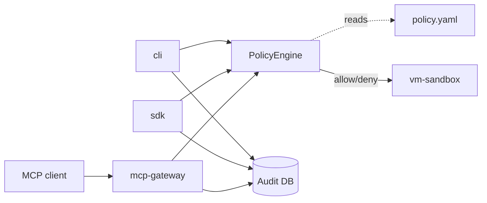

# Architecture

VaultMind is an npm workspace monorepo. Five packages and a static dashboard sit at the
root; `packages/*` holds the libraries and `dashboard` holds the monitoring UI.

| Package | Responsibility |
| --- | --- |
| `@vaultmind/vm-core` | Shared types, the policy engine, the audit logger and the SQLite database |
| `@vaultmind/vm-sandbox` | Process sandbox with path ACLs and network blocking |
| `@vaultmind/mcp-gateway` | MCP proxy plus the HTTP/WebSocket API server |
| `@vaultmind/cli` | The `vaultmind` command |
| `@vaultmind/sdk` | Programmatic client and the fluent policy helper |

## Request flow

Everything terminates in `vm-core`. The policy engine is the single decision point, and the
gateway and CLI are both thin callers of it, so a verdict is computed the same way regardless
of which surface asked.

## Policy evaluation

`PolicyConfig` carries a version, a list of rules and a `default_action`. Each rule can
allow or deny action patterns, declare a network posture, or both. Evaluation returns a
verdict plus the id of the rule that produced it, which is what gets written to the audit log
— so any decision can be traced back to the rule responsible.

## Audit storage

Events are written to SQLite via `sql.js`, so the store is a file rather than a service. Each
event records the agent, the tool, the parameters as JSON, the verdict, and the reason. A
JSONL event log is maintained alongside it for streaming consumers.

## Known limitations

- **No kernel sandbox on Windows.** True seccomp/Landlock isolation requires Linux. The MVP
  provides policy-level process isolation only.
- **Network blocking is heuristic**, based on environment variables rather than a network
  namespace.
- **The SDK is an early preview** and its surface may change.