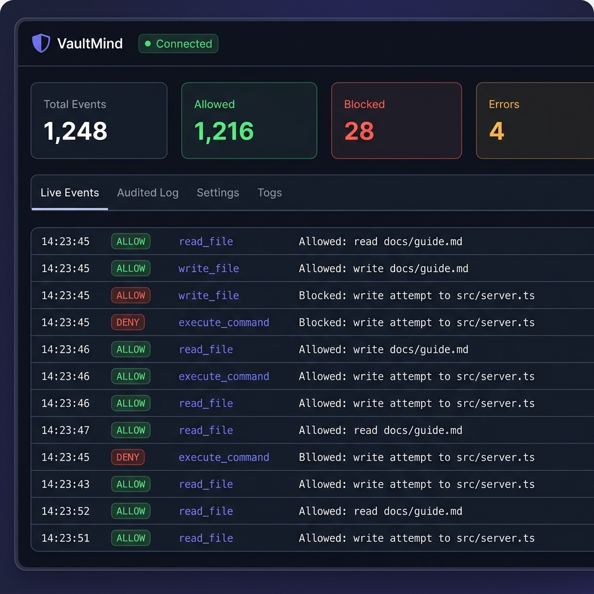

# VaultMind

**Offline-First AI Environment for Sensitive Code**

VaultMind is the first open-source policy decision point for AI coding agents that runs completely offline. It combines a lightweight secure MCP gateway, an immutable audit trail, and a software supply chain explorer.



## Key Features

- **Local MCP Gateway** - Offline proxy intercepting every tool call
- **Policy Engine** - Simple `policy.yaml` with allow/deny/network rules
- **Immutable Audit Trail** - Every event logged to SQLite + JSONL
- **Sandbox Execution** - Process isolation with path ACLs
- **Auto Policy Generation** - Generate policy from audit logs
- **Dependency Memoization** - Scan and verify dependency trees
- **Real-time Dashboard** - WebSocket-powered monitoring UI

## Architecture

```mermaid
flowchart TD
    subgraph Clients ["AI Clients (Local)"]
        Claude[Claude Desktop]
        Cursor[Cursor]
        VSCode[VS Code]
    end

    subgraph Gateway ["VaultMind Gateway (Local Proxy)"]
        VMGateway["vaultmind-gateway"]
    end

    subgraph Security ["Security Engine"]
        PolicyEngine["Policy Engine<br>(allow/deny/network rules)"]
        PolicyYaml["policy.yaml"]
    end

    subgraph Logs ["Immutable Audit Trail"]
        SQLite[("SQLite Audit Trail<br>(vault.db)")]
        JSONL["JSONL Event Log"]
    end

    subgraph Sandbox ["Isolation"]
        VMSandbox["Process Sandbox<br>(FS ACLs & Net Block)"]
    end

    %% Flow of Tool Calls
    Claude & Cursor & VSCode -->|MCP stdio/SSE| VMGateway
    VMGateway -->|1. Request Verdict| PolicyEngine
    PolicyYaml -.->|Defines Rules| PolicyEngine
    PolicyEngine -->|2. allow/deny/error| VMGateway
    VMGateway -->|3. Log Event| SQLite & JSONL
    VMGateway -->|4. Execute (If Allowed)| VMSandbox

    %% Styling
    classDef client fill:#111827,stroke:#3b82f6,stroke-width:2px,color:#f3f4f6;
    classDef gw fill:#1e1b4b,stroke:#6366f1,stroke-width:2px,color:#f3f4f6;
    classDef engine fill:#064e3b,stroke:#10b981,stroke-width:2px,color:#f3f4f6;
    classDef audit fill:#7c2d12,stroke:#f97316,stroke-width:2px,color:#f3f4f6;
    classDef sand fill:#581c87,stroke:#a855f7,stroke-width:2px,color:#f3f4f6;

    class Claude,Cursor,VSCode client;
    class VMGateway gw;
    class PolicyEngine,PolicyYaml engine;
    class SQLite,JSONL audit;
    class VMSandbox sand;
```

## Quick Links

- [Quick Start](quickstart.md)
- [Policy Guide](policy.md)
- [CLI Reference](cli.md)
- [API](api.md)
